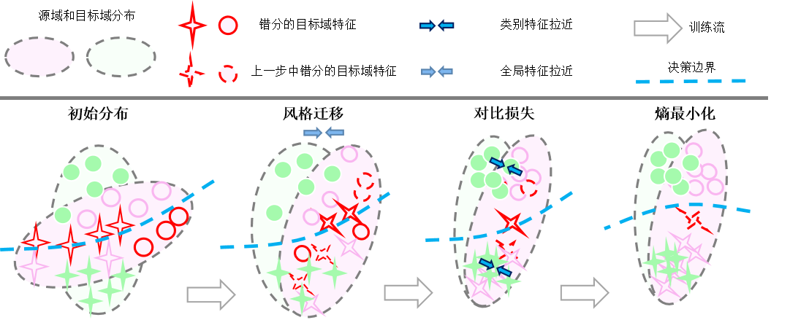

# CFContra: Unsupervised domain adaptation via coarse-to-fine feature alignment method using contrastive learning


## Paper



## Abstract
Previous feature alignment methods in Unsupervised domain adaptation(UDA) mostly only align global features without considering the mismatch between class-wise features. In this work, we propose a new coarse-to-fine feature alignment method using contrastive learning called CFContra. It draws class-wise features closer than coarse feature alignment or class-wise feature alignment only, therefore improves the model's performance to a great extent. We build it upon one of the most effective methods of UDA called entropy minimization to further improve performance. In particular, to prevent excessive memory occupation when applying contrastive loss in semantic segmentation, we devise a new way to build and update the memory bank. In this way, we make the algorithm more efficient and viable with limited memory. Extensive experiments show the effectiveness of our method and model trained on the GTA5 to Cityscapes dataset has boost mIOU by 3.5 compared to the MinEnt algorithm. Our code will be publicly available.
//## Demo
//[](http://www.youtube.com/watch?v=Ihmz0yEqrq0 "")

## Preparation

### Pre-requisites
* Python 3.8
* Pytorch 1.7.0
* CUDA 10.0 or higher

### Installation
0. Clone the repo:
```bash
$ git clone https://github.com/shiyutang/Coarse-to-fine-UDA.git
$ cd Coarse-to-fine-UDA
```

1. Install this repository and the dependencies using pip:
```bash
$ pip install -e <root_dir>
```

### Datasets
By default, the datasets are put in ```<root_dir>/data```. We use symlinks to hook the ADVENT codebase to the datasets. An alternative option is to explicitlly specify the parameters ```DATA_DIRECTORY_SOURCE``` and ```DATA_DIRECTORY_TARGET``` in YML configuration files.

* **GTA5**: Please follow the instructions [here](https://download.visinf.tu-darmstadt.de/data/from_games/) to download images and semantic segmentation annotations. The GTA5 dataset directory should have this basic structure:
```bash
<root_dir>/data/GTA5/                               % GTA dataset root
<root_dir>/data/GTA5/images/                        % GTA images
<root_dir>/data/GTA5/labels/                        % Semantic segmentation labels
...
```

* **Cityscapes**: Please follow the instructions in [Cityscape](https://www.cityscapes-dataset.com/) to download the images and validation ground-truths. The Cityscapes dataset directory should have this basic structure:
```bash
<root_dir>/data/Cityscapes/                         % Cityscapes dataset root
<root_dir>/data/Cityscapes/leftImg8bit              % Cityscapes images
<root_dir>/data/Cityscapes/leftImg8bit/val
<root_dir>/data/Cityscapes/gtFine                   % Semantic segmentation labels
<root_dir>/data/Cityscapes/gtFine/val
...
```

### Pre-trained models
Pre-trained models can be downloaded [here](https://github.com/valeoai/ADVENT/releases) and put in ```<root_dir>/pretrained_models```

## Running the code
For evaluation, execute:
```bash
$ cd <root_dir>/advent/scripts
$ python test.py --cfg ./configs/minent_pretrained.yml
```

### Training
For the experiments done in the paper, we used pytorch 1.7.0 and CUDA 10.2. To ensure reproduction, the random seed has been fixed in the code. Still, you may need to train a few times to reach the comparable performance.

By default, logs and snapshots are stored in ```<root_dir>/experiments``` with this structure:
```bash
<root_dir>/experiments/logs
<root_dir>/experiments/snapshots
```

```
To train:
```bash
$ python train.py --cfg ./configs/minent.yml
$ python train.py --cfg ./configs/minent.yml --tensorboard         % using tensorboard
```

### Testing
```bash
$ python test.py --cfg ./configs/minent.yml
```

## Acknowledgements
This codebase is heavily borrowed from [Advent](https://github.com/valeoai/ADVENT) and [SpCL](https://github.com/yxgeee/SpCL).

## License
CFContra is released under the [Apache 2.0 license](./LICENSE).
